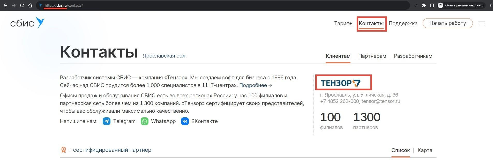
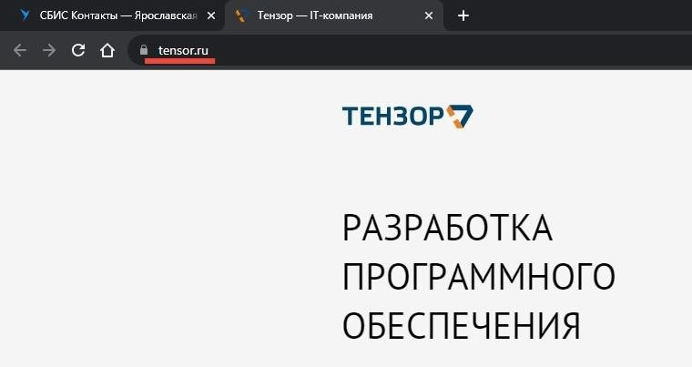
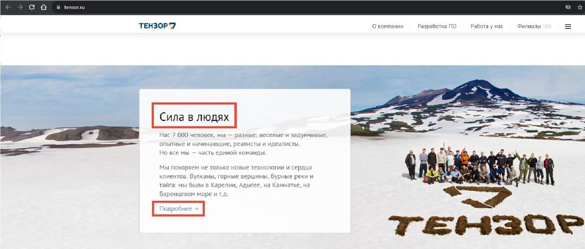
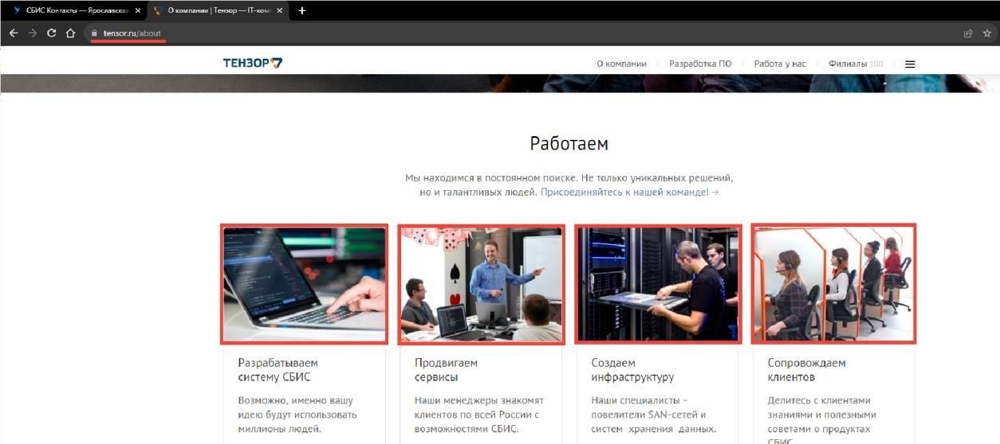
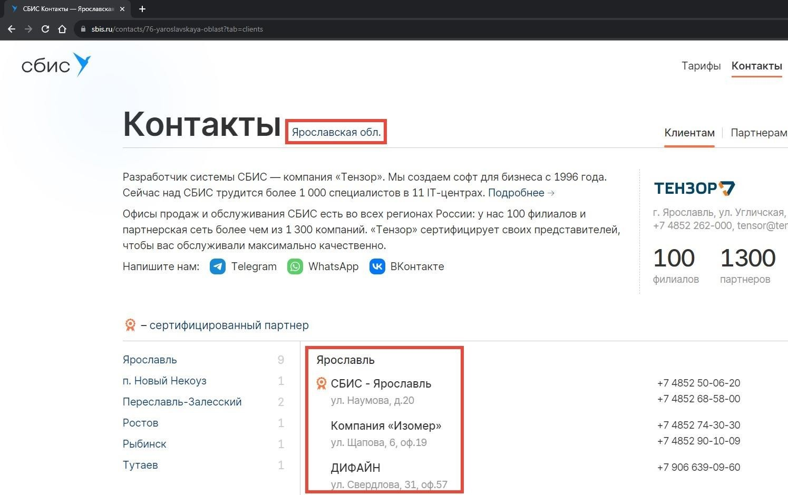
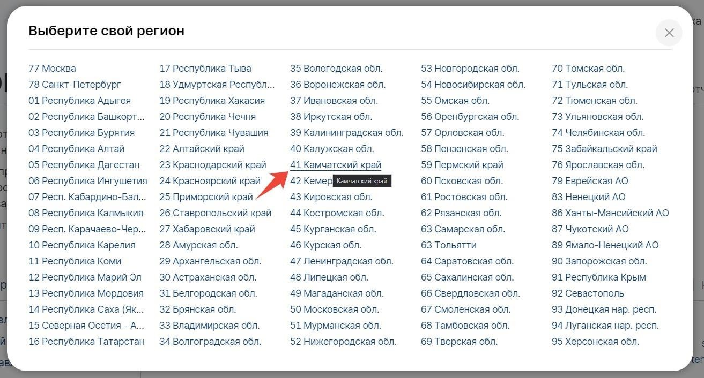
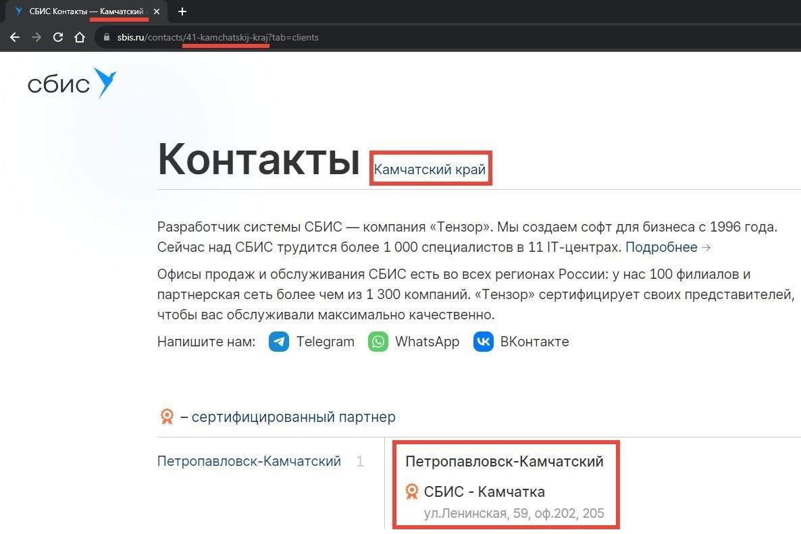
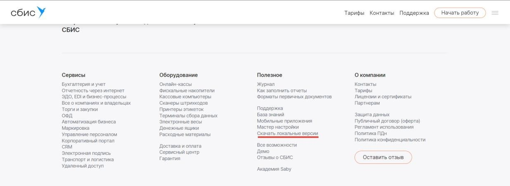
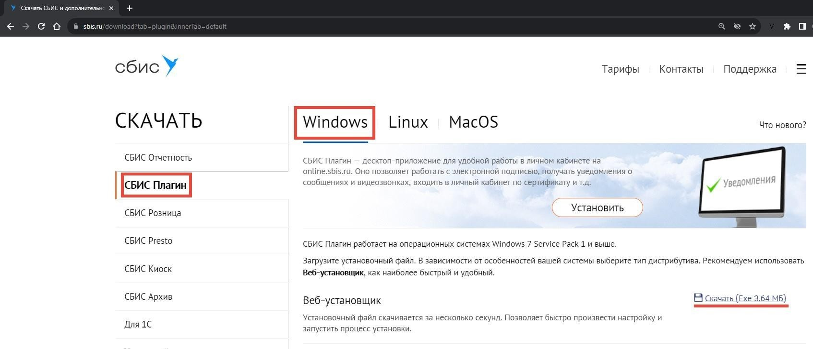

<h1>TensorTestAQA</h1>

Тестовое задание на позицию разработчика в тестировании (Программист-тестировщик).

<h2>Правила выполнения задания:</h2>
<ol>
  <li>Необходимо автоматизировать проверки двух обязательных сценариев.</li>
  <li>Третий сценарий выполнять не обязательно, но это будет дополнительным плюсом на техническом собеседовании.</li>
  <li>Автотесты реализованы на Python 3 и Selenium Webdriver</li>
  <li>В качестве тестового framework используется pytest</li>
  <li>Реализован паттерн PageObject</li>
  <li>Приветствуются любые сторонние библиотеки для логирования, отчетов, selenium wrapper</li>
  <li>Готовый проект залит на github/gitlab без кешей, драйверов и виртуальных окружений. С открытым доступом на чтение.</li>
</ol>

<h2>Первый сценарий:</h2>
<ol>
  <li>Перейти на <a href="https://sbis.ru/">https://sbis.ru/</a> в раздел "Контакты"</li>
  <li>Найти баннер Тензор, кликнуть по нему 
    
  </li>
  <li>Перейти на <a href="https://tensor.ru/">https://tensor.ru/</a> 
    
  </li>
  <li>Проверить, что есть блок "Сила в людях" 
    
  </li>
  <li>Перейти в этом блоке в "Подробнее" и убедиться, что открывается <a href="https://tensor.ru/about">https://tensor.ru/about</a></li>
  <li>Найти раздел Работаем и проверить, что у всех фотографий хронологии одинаковые высота (height) и ширина (width) 
    
  </li>
</ol>

<h2>Второй сценарий:</h2>
<ol>
  <li>Перейти на <a href="https://sbis.ru/">https://sbis.ru/</a> в раздел "Контакты"</li>
  <li>Проверить, что определился ваш регион (в нашем примере Ярославская обл.) и есть список партнеров. 
    
  </li>
  <li>Изменить регион на Камчатский край 
    
  </li>
  <li>Проверить, что подставился выбранный регион, список партнеров изменился, url и title содержат информацию выбранного региона 
    
  </li>
</ol>

<h2>Третий сценарий (необязательный):</h2>
<ol>
  <li>Перейти на <a href="https://sbis.ru/">https://sbis.ru/</a></li>
  <li>В Footer найти и перейти "Скачать локальные версии" 
    
  </li>
  <li>Скачать СБИС Плагин для вашей для windows, веб-установщик в папку с данным тестом 
    
  </li>
  <li>Убедиться, что плагин скачался</li>
  <li>Сравнить размер скачанного файла в мегабайтах. Он должен совпадать с указанным на сайте (в примере 3.64 МБ).</li>
</ol>